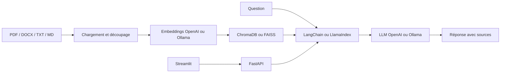

# Assistant documentaire RAG

[](https://github.com/Elie224/Assistant-documentaire-RAG/actions)
[](LICENSE)
[]()

Un projet complet de **Retrieval-Augmented Generation** capable d'indexer des documents, de retrouver les passages pertinents et de produire une réponse sourcée en français.

## Fonctionnalités

- import de fichiers PDF, DOCX, TXT et Markdown ;
- découpage configurable avec chevauchement ;
- génération avec Claude/Anthropic, OpenAI ou modèles locaux Ollama ;
- génération avec Claude/Anthropic, OpenAI ou modèles locaux Ollama ;
- embeddings OpenAI, Ollama, sentence-transformers (`semantic`) ou hashing lexical local (`local-lite`) ;
- orchestration interchangeable entre LangChain et LlamaIndex ;
- stockage vectoriel persistant avec ChromaDB ou FAISS ;
- API FastAPI documentée avec OpenAPI ;
- interface de chat Streamlit avec affichage des sources et pages ;
- historique conversationnel court et réponses limitées au contexte.

## Architecture



Les index de LangChain et LlamaIndex sont enregistrés dans des sous-dossiers distincts. Il est donc possible de tester toutes les combinaisons sans écraser un index existant.

## Installation

Prérequis : Python 3.11 ou 3.12.

```powershell
python -m venv .venv
.\.venv\Scripts\Activate.ps1
python -m pip install --upgrade pip
pip install -r requirements.txt
Copy-Item .env.example .env
```

### Option A — Anthropic avec embeddings locaux

Cette option n'utilise qu'une clé Anthropic. Le mode `local-lite` (par défaut) calcule des vecteurs lexicaux sans réseau, et le mode `semantic` télécharge un modèle `sentence-transformers` léger la première fois :

```dotenv
RAG_ENGINE=langchain
LLM_PROVIDER=anthropic
EMBED_PROVIDER=semantic
ANTHROPIC_API_KEY=sk-ant-votre-cle
ANTHROPIC_MODEL=claude-sonnet-4-5
LOCAL_SEMANTIC_MODEL=sentence-transformers/paraphrase-multilingual-MiniLM-L12-v2
VECTOR_STORE=chroma
```

Pour un mode 100 % hors ligne, utilisez `EMBED_PROVIDER=local-lite` : aucune clé externe n'est nécessaire mais la recherche reste lexicale.

### Option B — OpenAI

Modifiez `.env` :

```dotenv
RAG_ENGINE=langchain
LLM_PROVIDER=openai
EMBED_PROVIDER=openai
OPENAI_API_KEY=sk-votre-cle
VECTOR_STORE=chroma
```

### Option C — 100 % local avec Ollama

Installez [Ollama](https://ollama.com/), puis téléchargez les modèles :

```powershell
ollama pull llama3.1
ollama pull nomic-embed-text
```

Modifiez `.env` :

```dotenv
RAG_ENGINE=llamaindex
LLM_PROVIDER=ollama
EMBED_PROVIDER=ollama
VECTOR_STORE=faiss
```

## Démarrage

Lancez l'API dans un premier terminal :

```powershell
.\.venv\Scripts\Activate.ps1
uvicorn app.api:app --reload --host 127.0.0.1 --port 8000
```

Lancez l'interface dans un second terminal :

```powershell
.\.venv\Scripts\Activate.ps1
streamlit run app/ui.py
```

Ouvrez ensuite `http://localhost:8501`. La documentation interactive de l'API est disponible sur `http://127.0.0.1:8000/docs`.

Pour un premier essai, importez `examples/demo.md`, puis demandez : **« Quel est le montant de l'allocation pour l'équipement ? »**

## Configuration

| Variable | Valeur par défaut | Description |
|---|---:|---|
| `RAG_ENGINE` | `langchain` | `langchain` ou `llamaindex` |
| `LLM_PROVIDER` | `anthropic` | `anthropic`, `openai` ou `ollama` |
| `EMBED_PROVIDER` | `local` | `local`, `openai` ou `ollama` |
| `VECTOR_STORE` | `chroma` | `chroma` ou `faiss` |
| `CHUNK_SIZE` | `800` | Taille maximale d'un extrait |
| `CHUNK_OVERLAP` | `120` | Chevauchement entre extraits |
| `TOP_K` | `4` | Nombre d'extraits récupérés |
| `SCORE_THRESHOLD` | `0.25` | Seuil de pertinence LangChain |
| `MAX_UPLOAD_MB` | `20` | Taille maximale par fichier |

Changez de modèle Claude avec `ANTHROPIC_MODEL`, de modèle OpenAI avec `LLM_MODEL` et `EMBED_MODEL`, ou de modèle Ollama avec `OLLAMA_LLM_MODEL` et `OLLAMA_EMBED_MODEL`.

## API

- `GET /health` : affiche la pile active ;
- `POST /documents/ingest` : importe et indexe une liste de fichiers ;
- `POST /chat` : répond à une question avec les extraits sources ;
- `GET /docs` : interface Swagger générée automatiquement.

Exemple de question :

```powershell
$body = @{ question = "Quels sont les horaires du support ?"; history = @() } | ConvertTo-Json
Invoke-RestMethod -Method Post -Uri http://127.0.0.1:8000/chat -ContentType application/json -Body $body
```

## Tests

```powershell
pytest -q
```

Les tests unitaires n'appellent ni OpenAI ni Claude. La validation réelle de l'ingestion et du chat nécessite le fournisseur configuré dans `.env`. Une CI GitHub Actions exécute la suite à chaque push.
- LLM : `anthropic` · Embeddings : `embed_provider`
| LLM : `llm_provider` · Embeddings : `embed_provider` |
## Sécurité

L'API supporte une clé partagée optionnelle. Définissez `RAG_API_KEY` dans `.env` puis passez l'en-tête `X-API-Key` à chaque requête. L'interface Streamlit utilise automatiquement la clé si la variable `RAG_UI_API_KEY` est définie dans l'environnement de lancement.
